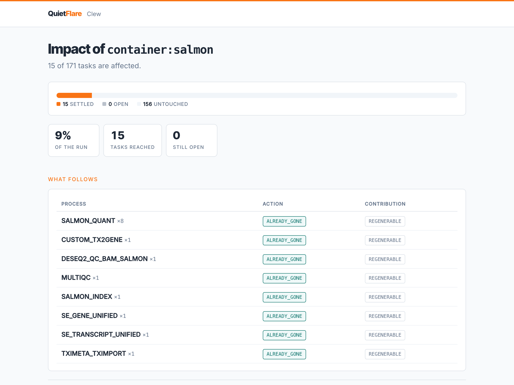

# Clew

[](https://pypi.org/project/clew-lineage/)
[](https://pypi.org/project/clew-lineage/)
[](https://github.com/QuietFlare/clew/actions/workflows/ci.yml)
[](LICENSE)

When something upstream of a pipeline goes bad, Clew tells you exactly what
to delete, re-run, or disclose, with a plan you can hand to an auditor.

A reference update, a buggy container, a contaminated sample, a withdrawn
consent. Clew rebuilds the lineage of your runs from what the engine already
recorded, follows the change through every result it reaches, and gives each
one a verdict with the evidence chain behind it. It reads Nextflow and Horus
today and has no engine of its own.

A clew is the ball of thread Ariadne gave Theseus. You follow it back out.



## Try it in two minutes

```bash
pip install clew-lineage
```

```bash
clew demo
```

The demo runs three triggers over a real nf-core/sarek run that ships with
the package, then crosses a run boundary. The base install has no
dependencies beyond Python 3.9. Only the event log needs a database driver,
via `pip install 'clew-lineage[log]'`.

## Three questions, one engine

On the shipped run, five synthetic donors and 81 tasks:

**The pipeline engineer: we bumped the reference genome. What must be re-run?**

```bash
clew impact --graph clew/data/graph5.json --samplesheet clew/data/donors.csv --input genome.fasta
```

72 of 81 tasks are calibrated against it. The other 9 are provably out of
scope, and the derivation chain is printed as evidence for every claim.

**QA: a defect was reported in a GATK4 container. What did it produce?**

```bash
clew impact --graph clew/data/graph5.json --samplesheet clew/data/donors.csv --container gatk4
```

16 tasks ran the container and 68 of 81 are suspect. Nothing is destroyed.
A defect casts doubt, it does not remove a source, so artifacts are rebuilt
rather than deleted.

**Compliance: a donor withdrew consent. What happens now?**

```bash
clew impact --graph clew/data/graph5.json --samplesheet clew/data/donors.csv \
    --subject donor_003 --assertions clew/data/assertions.json
```

16 of 81 tasks are affected. The 15 that exist only because of this donor
are destroyed where the artifacts still exist. The cohort report that also
serves the other donors, and was cited in a publication, resolves to
`NOTIFY_ONLY` instead. You cannot unpublish, so the answer there is
disclosure. One traversal, two verdicts.

Add `--html report.html` to any of these for the page shown above.

## It follows the thread across runs

One withdrawal, two pipelines. A sample was withdrawn after an rnaseq run
had published a count matrix, and a separate differential expression run
had consumed it. Clew joins the two graphs at that published file and
answers across the boundary:

```
TRIGGER: withdrawal of SRR10441036_cox4d
AFFECTED: 57 of 183 tasks        (46 in the rnaseq run, 11 in the DE run)

da:29/ae3d99  DESEQ2_DIFFERENTIAL   REGENERABLE  shared
    via rna:f2/cefd0f[STAR_ALIGN] -> rna:0c/8143cf[SALMON_QUANT]
     -> rna:c9/9a30ba[CUSTOM_TX2GENE] -> rna:8e/b5be55[TXIMETA_TXIMPORT]
     -> da:e8/91c345[VALIDATOR] -> da:29/ae3d99[DESEQ2_DIFFERENTIAL]
```

Engine lineage sees each run in isolation. This graph is the part nobody
else has. It ships stitched:

```bash
clew impact --pipeline rnaseq --graph clew/data/graph_chain.json \
    --samplesheet clew/data/samplesheets/rnaseq_yeast.csv --subject SRR10441036_cox4d
```

## Every result gets one of three answers

Provenance tools record where data came from. None of them record whether a
contribution can be taken back out. That is the difference between a history
and a recall plan.

| Class | Meaning | Remediation |
|---|---|---|
| `SEPARABLE` | The contribution can be removed and the artifact survives | `PURGE` |
| `REGENERABLE` | It cannot be isolated, but the artifact can be recomputed from the remaining sources | `REGENERATE` |
| `IRREDUCIBLE` | Neither | `QUARANTINE` |

Anything unknown fails closed to `IRREDUCIBLE`. Telling someone their data is
clean when it is not is the one error that ends up in front of a regulator.

## Use it on your own runs

Clew reads the record your engine already writes. Nothing changes in the
pipeline.

| Source | Command |
|---|---|
| Nextflow native lineage, including Seqera Platform | `clew extract-store --store /path/to/.lineage --run <run> --json-out graph.json` |
| Horus, through [horus-lineage](https://github.com/QuietFlare/horus-lineage) | `clew extract-horus --run-dir ~/.horus-lineage/<run-id>/ --json-out graph.json` |
| DNAnexus, read-only over the API | `clew extract-dnanexus --analysis analysis-xxxx --json-out graph.json` |
| Workflow Run RO-Crate, as written by nf-prov | `clew extract-crate --crate ro-crate-metadata.json --json-out graph.json` |
| A Nextflow work directory, for runs that already happened | `clew extract-work --jsonl <run>.jsonl --work work/ --json-out graph.json` |

Then ask:

```bash
clew impact --graph graph.json --container gatk4
```

The sources differ in how much evidence they carry, and evidence is what
verdicts are made of. [Lineage sources](docs/sources.md) has the comparison
and the limits of each. Triggers combine a selector, where the problem
enters the graph, with a mode, what kind of wrong it is. [Triggers](docs/triggers.md)
has the full grid, including the generic `--trigger kind:value` form that
answers label queries on engines that record labels.

## Built to be checked by someone who does not trust you

A plan on a terminal is a claim. The rest of Clew exists so that a third
party can verify the claim without your database, your network, or your
code being the thing that says so.

- **Storage is checked, never assumed.** Verdicts that depend on whether
  bytes still exist come back `UNDETERMINED` until Clew is told where to
  look. [Storage](docs/storage.md)
- **Facts nobody can edit afterwards.** An append-only, hash-chained event
  log on Postgres with two clocks: when a fact became true and when it was
  learned. [Event log](docs/event-log.md)
- **Policy as versioned data.** The remediation rules are a content-hashed
  table. A plan from March replays under the table that produced it.
  [Policy versioning](docs/policy.md)
- **Evidence that verifies offline.** A bundle re-derives every verdict from
  the bundled facts and policy. No database, no credentials. Signed with
  the OpenSSH keys you already have. [Evidence bundles](docs/evidence.md)
- **A gate that fails closed.** Before a run starts, every subject is
  blocked, cleared or unknown, and unknown stops the build.
  [The CI gate](docs/gate.md)
- **Auditor surfaces.** A self-contained dashboard with no timestamp, and a
  read-only MCP server whose every answer carries its citations.
  [For auditors](docs/auditors.md)

How the pieces fit, what Clew claims and what it does not, and how to run
the tests are in [Architecture](docs/architecture.md).

## Status

Extraction from Nextflow, Horus, RO-Crate and work directories, verified on
real runs. DNAnexus extraction built from the documented API and awaiting
its first live analysis. Blast radius for subject, container, input and
label triggers. Contribution classes with fail-closed defaults, remediation
plans, publication assertions, the append-only log, versioned policy, sealed
bundles that replay offline, the CI gate, the dashboard and the MCP server.
Stdlib only.

Not built: a log identity, and domain adapters beyond nf-core pipelines.
[CHANGELOG.md](CHANGELOG.md) lists what changed in each release.

## Contributing

Issues and pull requests are welcome, especially from people who run
pipelines for a living and can say where the model is wrong. See
[CONTRIBUTING.md](CONTRIBUTING.md). No agreement to sign.

## License

[AGPL-3.0](LICENSE).
