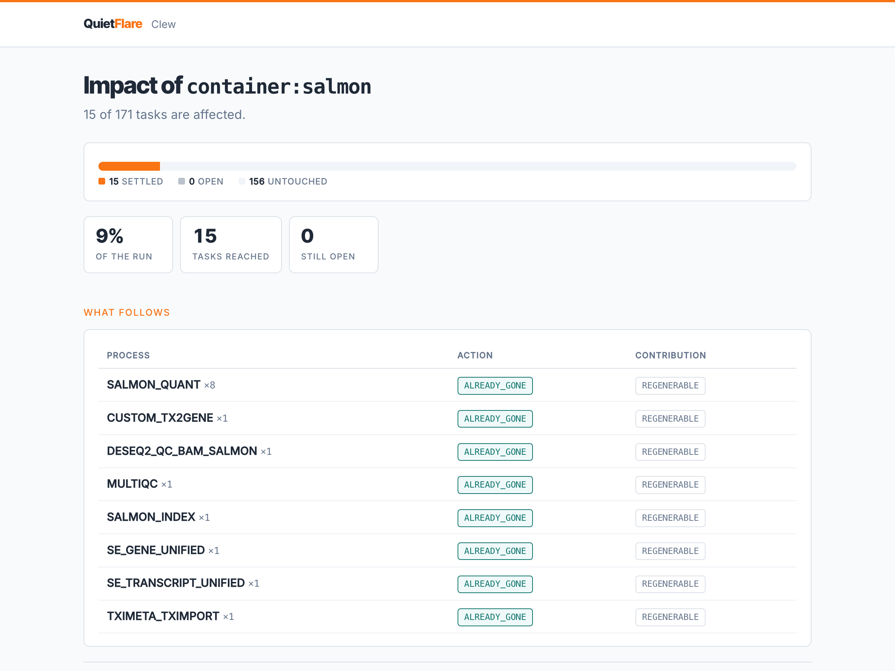

# Clew

[](https://pypi.org/project/clew-lineage/)
[](https://pypi.org/project/clew-lineage/)
[](https://github.com/QuietFlare/clew/actions/workflows/ci.yml)
[](LICENSE)

Clew turns the lineage your workflow engine already writes into decisions
you can defend. When an input or container goes bad, it says what to do
about each output it reached. When the disk fills up, it names the work
directories that are safe to delete and shows why. When an incident
report arrives as a sentence, it turns the sentence into a question the
run can answer, or holds it for a person. You can seal any of these
decisions as evidence that an auditor checks offline, with no access to
your systems.

It reads the record from Nextflow, Snakemake, Cromwell, Horus, DNAnexus
and Latch, and changes nothing in your pipeline. No model touches a
verdict: where a model is used, it proposes, versioned rules decide, and
the record says which model was asked.

The examples are from genomics because that is where it was first used.
The graph underneath is neutral: tasks that read files and write files,
whatever the field.

In the field's terms: Clew is data lineage and provenance turned into
impact analysis and remediation planning, with policy as versioned data,
an append-only hash-chained audit log, and offline-verifiable evidence
bundles. Incident intake is a typed classification step, a model choosing
from a fixed option set with a confidence, under deterministic decision
rules and a human-in-the-loop decision on anything held. The agentic
layer exposes the same steps as MCP tools, runs them under a governed
agent runtime, and lets an agent generate providers that pass a
code-based conformance check before a person approves them. A read-only
MCP server serves the evidence to auditors with citations.

A clew is the ball of thread Ariadne gave Theseus. You follow it back out.

## Install

```bash
pip install clew-lineage
clew --version
clew demo
```

Python 3.9 or later. The core has no dependencies. The demo runs three
questions over a real nf-core/sarek run of 81 tasks that ships with the
package, so you can see every kind of answer before touching your own
runs. Steps 1 to 5 below need nothing more. Step 6, the agent, needs
[Mainsheet](https://github.com/QuietFlare/mainsheet), which
`pip install "clew-lineage[agent]"` brings in. `clew serve` works with
any MCP client without it.

## The flow

Every use of Clew follows the same six steps. Each step is one command,
reads what the step before wrote, and leaves a file the next step reads.
Nothing is held in memory between them, so any step can be rerun or
checked on its own.

```
engine record --> graph.json --> plan.json --> bundle/ --> auditor
   extract         ask            seal         share
                   triage, decide
```

### 1. Extract: the engine's record becomes one graph

Point Clew at where your workflow was launched. The engine's own record
is read, and `graph.json` is written: every task, every file it read and
wrote, and the content digests the engine recorded.

| Engine | Command |
|---|---|
| Nextflow, including Seqera Platform | `clew extract nextflow --store .lineage --run <run> --json-out graph.json` |
| Snakemake | `clew extract snakemake --workdir . --json-out graph.json` |
| Cromwell and WDL, including Terra | `clew extract cromwell --metadata metadata.json --json-out graph.json` |
| Horus, through [horus-lineage](https://github.com/QuietFlare/horus-lineage) | `clew extract horus --run-dir <run> --json-out graph.json` |
| DNAnexus | `clew extract dnanexus --analysis <id> --json-out graph.json` |
| Latch | `clew extract latch --execution <id> --json-out graph.json` |

`clew extract` alone lists every engine installed. Two helpers belong to
this step. `clew digest` reads each file of a run once and fills in
digests an engine did not record, which is what makes drift and reclaim
exact. `clew stitch --graph a=a.json --graph b=b.json --out chain.json`
joins runs that consumed each other's outputs, by digest, so a question
follows a change across launches and machines.

`reclaim`, `drift`, `digest` and `impact` also take `--runs` pointing at
the engine's record itself, and read the run they need without a file.

### 2. Ask: what did a change reach, and what should happen

**Something upstream went bad.** A reference update, a broken container,
an input that turned out wrong.

```bash
clew impact --graph graph.json --container gatk4 --json plan.json
```

Every affected task gets a verdict, re-run, quarantine, delete or
disclose, with the derivation chain as evidence and the policy version
that produced it. A verdict that depends on whether an artifact still
exists needs `--work-root` and `--results`. Without them it is withheld
as UNDETERMINED, never guessed. Nothing unknown is reported as clean.

**The disk is full and nothing is wrong.**

```bash
clew reclaim --graph graph.json --work-root work/ --results results/
```

Proposes only the directories the graph proves redundant, and deletes
nothing without `--apply` and a receipt. `s3://bucket/prefix` works as
either root.

**Did the new version produce what the old one did?**

```bash
clew drift --before a.json --after b.json
```

Names the first task on each chain whose outputs differ and why: an
input changed, a container changed, or nothing changed and the tool is
not deterministic. Everything else is confirmed reproduced, digest for
digest.

Add `--html report.html` to any of the three for a one-page report.



### 3. Triage: an incident report becomes a question

Most changes arrive as a sentence, not a trigger: a tool advisory, a
release note, a withdrawal. Triage turns the sentence into one of the
triggers this run can answer, or holds it.

```bash
clew triage --graph graph.json --json triage.json "the duplicate marking step flags optical duplicates wrongly"
```

The options offered are the run's own: every tool its containers name,
every outside input, every label, and the kinds a pipeline adapter
declares. A classifier picks one and says how sure it is. Versioned
settings then decide: ask the trigger, hold the incident for a person,
or dismiss it. Dismissing needs more confidence than asking, and is
refused outright when the sentence names an id the run's record
contains. With `TYPESAFE_API_KEY` set the classifier is TypeSafe's Jev;
without it, names are matched. The record carries the backend, the model
and the hash of the request, so the same question can be asked again.

A held incident waits for a person, who decides under their own name:

```bash
clew decide --record triage.json --ask container:gatk4 --actor "qa lead" --reason "the advisory names our version"
```

Exit codes say what happened: 0 asks, 1 holds, 3 dismisses. A pipeline
plugin can do the asking itself with `--print-request` and `--answer`.

### 4. Seal: the answer becomes evidence

```bash
clew evidence seal --plan plan.json --out bundle/
clew evidence verify bundle/
```

A bundle holds the plan, the policy it was computed under, the triage
record and decision where there was one, and the hashes of every input.
`verify` recomputes every verdict from the bundle alone, with no
database, no credentials and no access to the run. `witness` checks a
live log against what the bundle saw, and `sign` countersigns it with an
SSH key.

Optionally, an event log keeps what people decided and adopted, as an
append-only, hash-chained table on Postgres. Nothing is typed into it by
hand: `triage` and `decide` write to it when `--dsn` names it, `clew
rulebook register` records the adoption of a policy version, and a bundle
built with `--dsn` witnesses the log head it saw, so a later reader can
tell whether anything was removed afterwards.

```bash
clew log verify
```

`clew rulebook` shows and diffs the versioned policy table, so an old
plan replays under the rules that produced it. `clew gate` reads the log
before a run starts and blocks a run whose inputs it says are not
usable, failing closed on anything unknown.

### 5. Share: an auditor checks it without you

```bash
clew dashboard --bundles bundles/ --out clew.html
clew mcp --bundles bundles/
```

The dashboard is one self-contained HTML page over every bundle. The MCP
server answers an auditor's questions in their own words, from the
bundles alone, read-only, with a citation on every answer and an
instruction to the model never to conclude compliance.

### 6. Automate: an agent runs the steps, a person keeps the decisions

The agent that runs steps 3 and 4 for you is a
[Mainsheet](https://github.com/QuietFlare/mainsheet) agent. Mainsheet is
our agent runtime: it reads one definition file, runs the model with
exactly the tools that file allows, checks every tool call against a
policy before it runs, keeps it inside a sandbox with no network, and
signs a record of the run. `clew ui` and `clew build` start it for you,
so both need Mainsheet installed in the same environment:

```bash
pip install "clew-lineage[agent]"
clew ui
```

`clew ui` is a page on this machine: pick a run folder, write the
incident, and watch triage, impact and evidence appear as their files
do. A held incident shows a decision card, and the agent has no tool to
decide one. The definition it runs is
[clew/agent/agent.yaml](clew/agent/agent.yaml): the model, the prompt,
the seven Clew tools, and the limits on each.

```bash
clew serve --dir /path/to/dir
```

`clew serve` needs no Mainsheet. It offers the same seven steps as tools
over MCP to any agent that speaks it, Claude Code, Cursor or your own:
inbox, triage, impact, seal, options, the incident text, and a
recommendation on a held incident. No tool takes a trigger, which
travels from triage to impact in the record on disk, and no tool decides
a held incident. [skills/clew-incident](skills/clew-incident/SKILL.md)
gives the flow to a person's own coding agent. What such an agent lacks
is Mainsheet's gate and record, which is why the tools are built to be
safe by what they take.

## Command reference

| Command | Does |
|---|---|
| `clew demo` | the shipped sample run: three triggers, one engine |
| `clew extract <engine>` | build a graph from an engine's record |
| `clew digest` | hash a run's files once, for graphs without content digests |
| `clew stitch` | join run graphs where one run consumed another's outputs |
| `clew impact` | what a removal, defect or update reaches, and what to do |
| `clew reclaim` | which work directories are safe to delete, with proof |
| `clew drift` | where two runs of the same workflow part ways, and why |
| `clew triage` | turn an incident report into a trigger, or hold it for a person |
| `clew decide` | record a person's decision on an incident that triage held |
| `clew evidence` | build, verify, witness and sign evidence bundles |
| `clew log` | the append-only event log: init, append, list, verify, head |
| `clew rulebook` | the versioned remediation policy: show, export, check, diff, register |
| `clew gate` | block a run whose inputs the log says are not usable |
| `clew dashboard` | one self-contained HTML page over sealed bundles |
| `clew mcp` | read-only MCP server over sealed bundles, for auditors |
| `clew ui` | a local page: pick a run, give an incident, watch the agent work |
| `clew serve` | Clew's working tools over MCP, for any agent |
| `clew build` | have an agent write an adapter or an extractor, then check it |
| `clew providers` | every adapter and extractor installed, or approve one a judge passed |

Every command answers `--help` with its flags.

## Providers: your pipeline, your engine

Clew knows nothing about any field. What a site knows about one pipeline,
that an id in a launch sheet is a specimen and which tasks it entered,
lives in an **adapter**. An engine Clew cannot read yet gets an
**extractor**. Both are one Python class, found by name, with no change
inside Clew. [How to build your own](docs/providers.md#build-your-own-three-ways)
has the three ways, by hand, with your own coding agent, or with Clew's,
and the guide below it.

An agent can write one. It works in a sandbox, a conformance check it
never sees runs on what it wrote, and nothing loads until a person has
read the code and approved it under their name:

```bash
clew build adapter --graph graph.json --name site-ligands --kind ligand --sheet ligands.smi
clew providers --approve ~/.clew/ui/jobs/<build>/verdict.json --actor "your name"
```

The approval record pins the file's hash. A changed file stops loading
until someone approves it again. [skills/clew-provider](skills/clew-provider/SKILL.md)
gives the same brief to a person's own coding agent.

## What is guaranteed

- **Storage is checked, never assumed.** A verdict that depends on a file
  existing is withheld until the file is looked at.
- **Rules are versioned data.** Every plan names its policy version and
  hash, and an old plan replays under the rules that produced it.
- **A model never writes a verdict.** It picks a trigger from a fixed
  list, or recommends on a held incident. Settings and people decide,
  and the record names the model asked.
- **Facts are append-only.** The event log is hash-chained with two
  clocks, and a bundle witnesses the log head it saw.
- **Evidence verifies offline.** A bundle re-derives every verdict with
  no database and no credentials.
- **Agents are governed.** Under Mainsheet every tool call passes a
  policy gate and is signed. Over MCP the tools stay safe by what they
  take: an id, never a trigger or code.
- **The engine stays neutral.** A test fails the build if the graph, the
  ledger or the contracts mention a sample, a donor, a consent or an
  engine.

[Storage](docs/storage.md), [event log](docs/event-log.md),
[policy](docs/policy.md), [evidence](docs/evidence.md), [gate](docs/gate.md),
[auditor surfaces](docs/auditors.md), [architecture](docs/architecture.md),
[sources](docs/sources.md) for what each engine records and what that limits.

## Status

Verified on real Nextflow, Snakemake, Cromwell and Horus runs. DNAnexus
and Latch are built from the platform APIs and await their first live
runs. Triage has one eval baseline, on the release notes of sixteen
projects. The adapter builder has run live once. 894 tests run on Python
3.9, 3.11 and 3.13 on every push. [CHANGELOG.md](CHANGELOG.md) lists what
changed in each release.

## Contributing

Issues and pull requests are welcome, especially from people who run
workflows for a living and can say where the model is wrong. See
[CONTRIBUTING.md](CONTRIBUTING.md). No agreement to sign.

## License

[AGPL-3.0](LICENSE).
