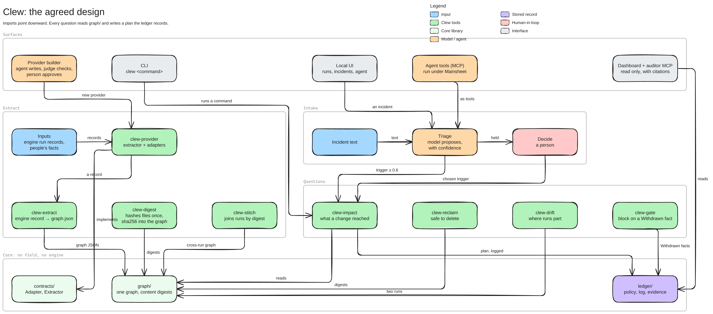

# Clew

[](https://pypi.org/project/clew-lineage/)
[](https://pypi.org/project/clew-lineage/)
[](https://github.com/QuietFlare/clew/actions/workflows/ci.yml)
[](LICENSE)

Clew turns the lineage your workflow engine already writes into decisions
you can defend. When an input or container goes bad, it says what to do
about each output it reached. When the disk fills up, it names the work
directories that are safe to delete and shows why. When an incident
report arrives as a sentence, it turns the sentence into a question the
run can answer, or holds it for a person. Any of these decisions can be
sealed as evidence that an auditor checks offline.

It reads the record from Nextflow, Snakemake, Cromwell, Horus, DNAnexus
and Latch, and changes nothing in your pipeline. No model touches a
verdict: where a model is used, it proposes, versioned rules decide, and
the record says which model was asked. The examples are from genomics
because that is where it was first used. The graph underneath is tasks
that read and write files, whatever the field.

A clew is the ball of thread Ariadne gave Theseus. You follow it back out.

## Try it in five minutes

**In a Codespace.** Clew, Nextflow and two recorded nf-core/demo runs are
installed when it opens. Type:

[](https://codespaces.new/QuietFlare/clew)

```bash
clew extract nextflow --store examples/demo-run/.lineage --list-runs
```

Then follow [docs/try.md](docs/try.md): impact, drift and reclaim on those
two runs, and the page.

**On your own machine.** Python 3.9 or later, no dependencies:

```bash
pip install clew-lineage
clew demo
```

`clew demo` runs three questions over a sample run that ships with the
package. [docs/try.md](docs/try.md) takes it from there.

## The flow

Six steps, one command each. Every step reads what the one before wrote
and leaves a file the next one reads, so any step can be rerun or checked
on its own.

```
engine record --> graph.json --> plan.json --> bundle/ --> auditor
   extract         ask            seal         share
                   triage, decide
```



### 1. Extract

Point Clew at where the workflow was launched. The engine's own record
becomes `graph.json`: every task, every file it read and wrote, and the
content digests the engine recorded.

```bash
clew extract nextflow --store .lineage --run <run> --json-out graph.json
```

`clew extract` alone lists every engine installed. `clew digest` fills in
digests an engine did not record. `clew stitch` joins runs that consumed
each other's outputs. [Sources](docs/sources.md) says what each engine
records and what that limits.

### 2. Ask

```bash
clew impact  --graph graph.json --container gatk4 --json plan.json
clew reclaim --graph graph.json --work-root work/ --results results/
clew drift   --before a.json --after b.json
```

Impact gives every affected task a verdict, re-run, quarantine, delete or
disclose, with the derivation chain as evidence and the policy version
that produced it. Reclaim proposes only the directories the graph proves
redundant and deletes nothing without `--apply`. Drift names the first
task on each chain whose outputs differ, and why. A verdict that depends
on a file existing is withheld, never guessed. Add `--html report.html`
to any of the three for a one-page report. More in
[storage](docs/storage.md), [reclaim](docs/reclaim.md) and
[drift](docs/drift.md).


### 3. Triage

```bash
clew triage --graph graph.json --json triage.json "the duplicate marking step flags optical duplicates wrongly"
clew decide --record triage.json --ask container:gatk4 --actor "qa lead" --reason "the advisory names our version"
```

A classifier picks one of the run's own triggers and says how sure it is.
Versioned settings then ask it, hold it for a person, or dismiss it. A
held incident waits until someone decides under their own name. More in
[triage](docs/triage.md) and [triggers](docs/triggers.md).

### 4. Seal

```bash
clew evidence seal --plan plan.json --out bundle/
clew evidence verify bundle/
```

A bundle holds the plan, the policy it was computed under, the triage
record and decision, and the hashes of every input. `verify` recomputes
every verdict from the bundle alone, with no database and no
credentials. An optional event log on Postgres keeps what people decided,
append-only and hash-chained, and `clew gate` reads it before a run
starts. More in [evidence](docs/evidence.md), [event log](docs/event-log.md),
[policy](docs/policy.md) and [gate](docs/gate.md).

### 5. Share

```bash
clew dashboard --bundles bundles/ --out clew.html
clew mcp --bundles bundles/
```

One self-contained HTML page over every bundle, and a read-only MCP
server that answers an auditor's questions from the bundles alone, with a
citation on every answer. More in [for auditors](docs/auditors.md).

### 6. Automate

```bash
pip install "clew-lineage[agent]"
clew ui
```

A [Mainsheet](https://github.com/QuietFlare/mainsheet) agent runs steps 3
and 4 under a policy gate, in a sandbox, with a signed record of the run.
`clew ui` is the page to watch it work. `clew serve` offers the same seven
tools over MCP to any agent, and no tool decides a held incident. More in
[the agent](docs/agent.md).

## Command reference

| Command | Does |
|---|---|
| `clew demo` | the shipped sample run: three triggers, one engine |
| `clew extract <engine>` | build a graph from an engine's record |
| `clew digest` | hash a run's files once, for graphs without content digests |
| `clew stitch` | join run graphs where one run consumed another's outputs |
| `clew impact` | what a removal, defect or update reaches, and what to do |
| `clew reclaim` | which work directories are safe to delete, with proof |
| `clew drift` | where two runs of the same workflow part ways, and why |
| `clew triage` | turn an incident report into a trigger, or hold it for a person |
| `clew decide` | record a person's decision on an incident that triage held |
| `clew evidence` | build, verify, witness and sign evidence bundles |
| `clew log` | the append-only event log: init, append, list, verify, head |
| `clew rulebook` | the versioned remediation policy: show, export, check, diff, register |
| `clew gate` | block a run whose inputs the log says are not usable |
| `clew dashboard` | one self-contained HTML page over sealed bundles |
| `clew mcp` | read-only MCP server over sealed bundles, for auditors |
| `clew ui` | a local page: pick a run, give an incident, watch the agent work |
| `clew serve` | Clew's working tools over MCP, for any agent |
| `clew build` | have an agent write an adapter or an extractor, then check it |
| `clew providers` | every adapter and extractor installed, or approve one a judge passed |

Every command answers `--help` with its flags.

## Providers: your pipeline, your engine

Clew knows nothing about any field. What a site knows about one pipeline,
that an id in a launch sheet is a specimen and which tasks it entered,
lives in an adapter. An engine Clew cannot read yet gets an extractor.
Both are one Python class, found by name, with no change inside Clew.
An agent can write one: it works in a sandbox, a conformance check it
never sees runs on what it wrote, and nothing loads until a person has
read the code and approved it under their name.

```bash
clew build adapter --graph graph.json --name site-ligands --kind ligand --sheet ligands.smi
clew providers --approve ~/.clew/ui/jobs/<build>/verdict.json --actor "your name"
```

[Providers](docs/providers.md) has the three ways to build one, by hand,
with your own coding agent, or with Clew's.

## What is guaranteed

- Storage is checked, never assumed. A verdict that depends on a file
  existing is withheld until the file is looked at.
- Rules are versioned data. Every plan names its policy version and hash,
  and an old plan replays under the rules that produced it.
- A model never writes a verdict. It picks a trigger from a fixed list,
  or recommends on a held incident. Settings and people decide, and the
  record names the model asked.
- Facts are append-only. The event log is hash-chained with two clocks,
  and a bundle witnesses the log head it saw.
- Evidence verifies offline. A bundle re-derives every verdict with no
  database and no credentials.
- Agents are governed. Under Mainsheet every tool call passes a policy
  gate and is signed. Over MCP the tools stay safe by what they take: an
  id, never a trigger or code.
- The engine stays neutral. A test fails the build if the graph, the
  ledger or the contracts mention a sample, a donor, a consent or an
  engine.

## Status

Verified on real Nextflow, Snakemake, Cromwell and Horus runs. DNAnexus
and Latch are built from the platform APIs and await their first live
runs. Triage has one eval baseline, on the release notes of sixteen
projects. The adapter builder has run live once. 894 tests run on Python
3.9, 3.11 and 3.13 on every push. [CHANGELOG.md](CHANGELOG.md) lists what
changed in each release.

## Contributing

Issues and pull requests are welcome, especially from people who run
workflows for a living and can say where the model is wrong. See
[CONTRIBUTING.md](CONTRIBUTING.md). No agreement to sign.

## License

[AGPL-3.0](LICENSE).
