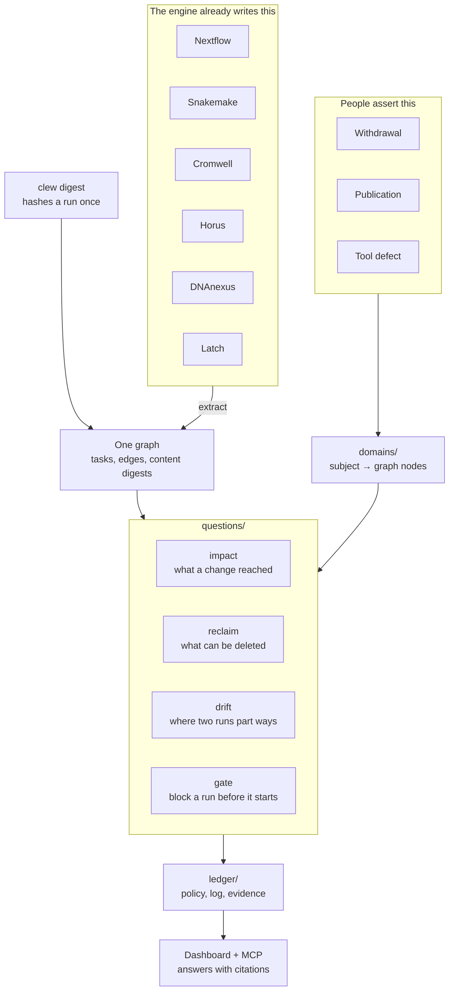

# Architecture

One graph, several recorders below it, one small tool per question above
it. Recorders turn what an engine wrote into the same graph JSON. Questions
read the graph and nothing else. Human facts, a withdrawal, a publication,
enter through the domain layer, which translates them into graph terms.
The graph and the ledger know nothing about any field or any engine.



```
clew/graph/      the one graph: loading, triggers, traversal, contribution
                 classes, digest indexes. Imports nothing else from clew.
clew/ledger/     versioned policy, event log, evidence bundles, the gate
                 decision, the query surface, and their commands.
clew/domains/    the layer allowed to know about sarek, samplesheets, donors.
clew/extract/    one extractor per engine, all emitting the same JSON,
                 plus stitch, digest, and runs, which reads the engine's
                 record directly.
clew/questions/  one module per question asked of the graph: impact,
                 reclaim, drift, gate.
clew/views/      dashboard, one page per question, MCP server.
tests/           stdlib unittest.
```

Packages import downward only. `graph/` imports nothing from clew, and
each package above it may reach only the layers below it. A new question
lives in `questions/` and imports `clew.graph`, which is also the public
API: `load_graph`, `blast_radius`, `classify`, `parse_trigger`,
`resolve_trigger`.

The vocabulary boundary is enforced by a grep. `graph/` and `ledger/` must
never mention a sample, a donor, a consent, or a workflow engine. Adding a
new domain, say AI training data with opt-out semantics, means adding a
directory rather than editing the engine. Both rules are
[tests/test_core_boundary.py](../tests/test_core_boundary.py). An unenforced
rule stays true right up until it doesn't.

## Identity

Files are identified by content digest, `<algorithm>:<value>`, carried on
outputs, on edges and on published files. Reclaim and stitch compare
digests and nothing else. Engines that hash content at write time supply
them; `clew digest` supplies them for runs that were recorded without.
[Sources](sources.md) draws the line between the two.

## Tests

```bash
python3 -m unittest discover -s tests
```

433 tests need nothing installed. The other 25 exercise the log's storage
behaviour, the role grants, the triggers and concurrent appends, and skip
unless you point them at a database you own:

```bash
CLEW_TEST_DSN=postgresql://user:pw@localhost:5432/clew python3 -m unittest discover -s tests
```

The log's arithmetic sits on the other side of that line on purpose.
Hashing and chain verification are pure functions on plain dicts, so an
auditor checking an exported bundle needs a JSON file and an interpreter,
not a database driver and a server.

## What Clew claims, and what it does not

Clew is a system of record, not an attester. It claims three things, all
checkable: the computation is deterministic, the result follows from the
inputs, and anyone can re-run it and get the same answer. It claims nothing
about whether your inputs were true or your policy was right. Your
assertions are inputs, not Clew's claims.

The edges of the model, reported rather than hidden:

- Traversal follows derivation and stops at influence. A published finding
  that informed a business decision is recorded as a terminal reference. It
  is not pretend-tracked.
- Uninstrumented systems are reported as unknown, never as clean.
- Clew proves the record was tombstoned and nothing later referenced it. It
  does not prove physical destruction. No cryptography reaches a freezer.

## Decisions

The rules above are recorded as decisions, one file each, in
[docs/adr](adr/): unknown is never clean, the engine knows no field and
no workflow engine, one graph with one tool per question, content
digests are the only identity, the engine's record is the record, and a
plan is the record while a page is a view. A change to any of them is a
new ADR that supersedes the old, not an edit.

## Not built

A log identity, so bundles from different logs are detected rather than
distinguished. A subject-facing transparency log. Domain adapters beyond
nf-core pipelines, though the generic label trigger covers engines that
record labels, Horus among them. Storage backends other than a local
filesystem for reclaim and digest.
